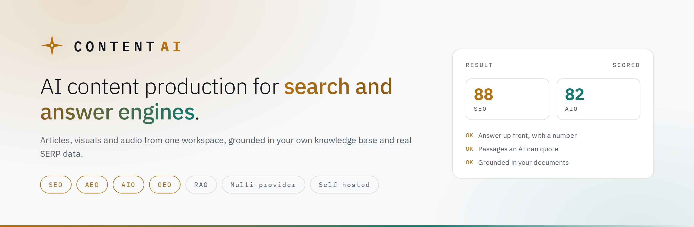
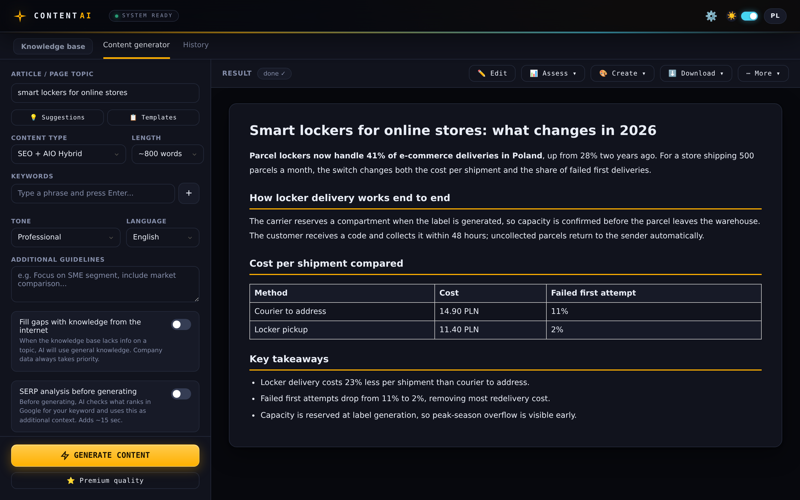
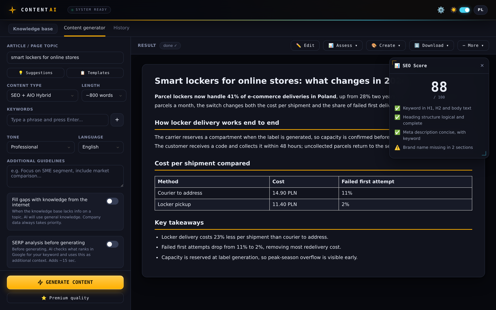
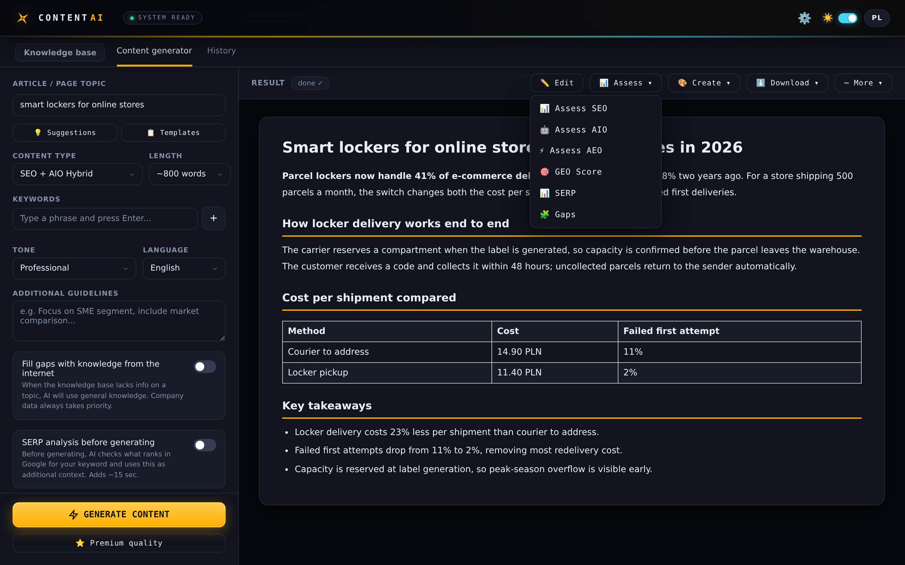
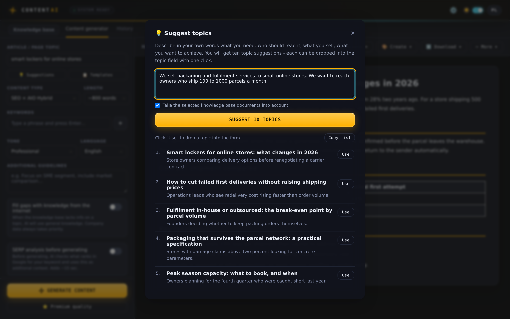
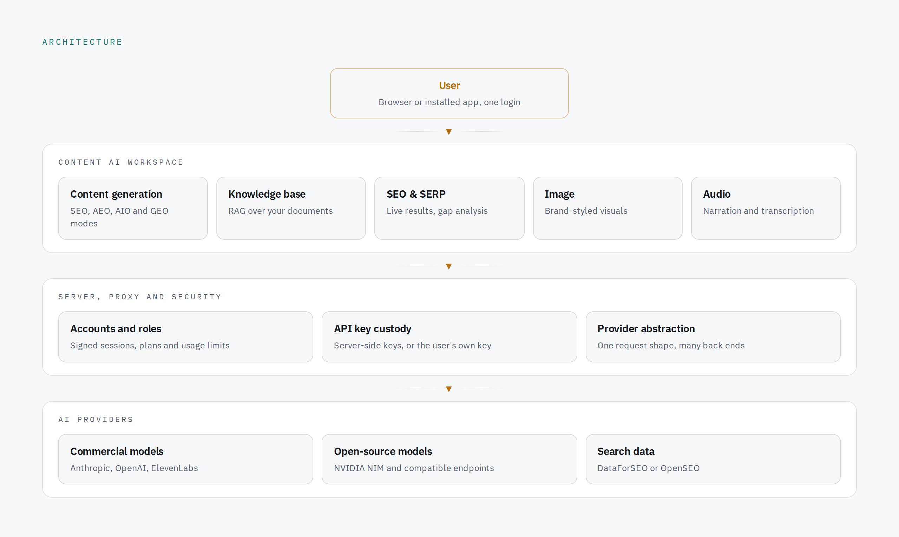

<picture>
  <source media="(prefers-color-scheme: dark)" srcset="docs/obrazy/banner-dark.png">
  
</picture>

# Content AI

**AI-powered content production platform for SEO, AEO, AIO and GEO.**
Create articles, visuals and audio from one workspace, grounded in your own knowledge base
and real search results, on the AI provider of your choice.

**Live:** [content-ai.net](https://content-ai.net) · **App:** [app.content-ai.net](https://app.content-ai.net)

**Use cases:** content creation · SEO research · AI visibility · brand voice · knowledge bases

[](https://github.com/Marcin1000/ContentAI/actions/workflows/kontrola.yml)


---

## Why it exists

Search stopped being one destination. The same article now has to satisfy a classic Google
result, an AI Overview, an answer engine and a model deciding what to cite. Writing four
versions of it is not a plan.

At the same time, general-purpose AI writing tools have two problems that show up the moment
you use them for real work:

**They do not know your business.** Prices, product names, what you actually sell. The output
reads well and says nothing you could publish without rewriting it.

**They are opaque about cost and data.** Your documents go somewhere, your bill is somebody
else's line item, and swapping the model underneath is not your decision.

Content AI answers all three: one piece of content optimised for every answer surface, written
from a knowledge base you control, running on a server and an API key that belong to you.

---

## Product capabilities

| | |
|---|---|
| **Four answer surfaces from one draft** | SEO for classic results, AIO for AI Overviews, AEO for answer engines, GEO for citations in models. Written once, optimised for all of them. |
| **Knowledge base with retrieval (RAG)** | Upload documents, links and transcripts. Only the passages that match the topic reach the prompt, not the whole base. Private and shared collections. |
| **Real search data, not guesses** | SERP analysis can pull live results from an API instead of asking the model what it remembers. Semantic gap analysis shows what the ranking pages cover and the draft does not. |
| **Scoring that leads to an edit** | Every draft is scored on SEO, AIO, AEO and GEO, with concrete findings and a one-click fix rather than a number on its own. |
| **Visuals and audio in the same window** | Brand-styled images from the article topic, narration and transcription, without leaving the workspace. |
| **Repurposing and export** | LinkedIn post, newsletter, FAQ section, landing intro. Export to DOCX, PDF, audio or JSON-LD, or publish straight to WordPress. |

---

## Screenshots

**One workspace: sources, brief, draft and every follow-up action.**



**Scoring is attached to the draft, not to a separate report.**



**Eighteen post-generation actions grouped into four menus.**



**Describe the business need, get ten topics with the search intent behind each one.**



---

## Architecture

<picture>
  <source media="(prefers-color-scheme: dark)" srcset="docs/obrazy/architecture-dark.png">
  
</picture>

The workspace is a single HTML file with no build step. The server is Node with **zero npm
dependencies**, which keeps the supply chain of a system holding API keys and customer
documents down to what is actually written in this repository.

The provider layer matters more than it looks. The application speaks one request shape; the
server translates it for whatever is behind it, so switching from a commercial model to an
open-source endpoint is a configuration change, not a rewrite.

---

## AI reliability

A language model is a component that fails in ways a function does not. It returns almost-valid
JSON, it does not know today's date, and it degrades quietly rather than throwing. Most of the
engineering here is about that.

| Problem | What the system does |
|---|---|
| **Malformed JSON** | Models emit unescaped quotes when they quote a phrase from your documents, which breaks `JSON.parse` mid-response. A repair pass resolves the ambiguity the way a reader would, and reports a readable error for the cases it genuinely cannot decide. |
| **Stale world model** | The model's knowledge ends before today, so it writes the year it remembers. Every prompt receives the current date, read from the clock at call time rather than frozen into the code. |
| **Silent i18n degradation** | A missing translation key does not crash; it shows a Polish sentence in the English interface. A machine check compares every used key against both dictionaries and fails the build. |
| **Dead controls** | A button calling a function that no longer exists does nothing at all, with no error. Every `onclick` handler in every built variant is verified to resolve. |
| **Regression in a 12,000-line file** | Each fix is pinned by a signature of the code after it and the code before it, so both a deletion and a revert are caught. |
| **Provider lock-in** | One request shape, several back ends, translated server-side. |
| **Key custody** | Keys stay on the server and never reach the browser, or the user supplies their own key which stays in their browser and is never written to the server. |

Every check above runs in CI and exits non-zero on failure. Each was verified to fail on an
injected fault, because a check that reports problems and still exits zero is worse than no
check at all.

```bash
python3 narzedzia/sprawdz_zrodlo.py    # build all variants, verify every fix is present
python3 narzedzia/audyt_i18n.py        # translation keys, both dictionaries
python3 narzedzia/audyt_uchwyty.py     # every event handler resolves
node serwer/testy.js                   # server logic, 214 tests
```

---

## Getting started

**Try it locally.** Open `app/web-keys.html` in a browser. Nothing to build or install; the
API keys panel opens by itself.

**Deploy for a team.** `serwer/` holds the Node server with accounts, roles, an API proxy, the
knowledge base and usage plans.

```bash
git clone https://github.com/Marcin1000/ContentAI.git /srv/contentai
cd /srv/contentai
sudo -u contentai node serwer/uzytkownicy.js dodaj <login> admin
```

Full step-by-step installation, Cloudflare setup and day-to-day administration are in
[`dokumenty/`](dokumenty/).

---

## Documentation

| Document | What it covers |
|---|---|
| [`dokumenty/ContentAI_Dokumentacja_techniczna.md`](dokumenty/ContentAI_Dokumentacja_techniczna.md) | Full technical reference: build system, conditional directives, variants, repository layout |
| [`serwer/README.md`](serwer/README.md) | Server: every setting, endpoint and design decision |
| [`dokumenty/ContentAI_Instalacja_na_serwerze.md`](dokumenty/ContentAI_Instalacja_na_serwerze.md) | Installation from an empty VPS, written without assuming Linux experience |
| [`dokumenty/ContentAI_Domena_Cloudflare.md`](dokumenty/ContentAI_Domena_Cloudflare.md) | Domain behind Cloudflare: product page and app subdomain |
| [`dokumenty/ContentAI_AdminGuide.md`](dokumenty/ContentAI_AdminGuide.md) | Day-to-day operation: accounts, plans, keys |
| [`dokumenty/ContentAI_Audyt_2026-08.md`](dokumenty/ContentAI_Audyt_2026-08.md) | Pre-deployment audit: what was checked, with what, and the result |

The application interface ships in English and Polish. The technical documentation is written
in Polish.

---

## Repository notes

The application is built from a single source file, `app/contentai.src.html`, into three
variants that differ only in how API keys are supplied:

| Variant | Keys | For |
|---|---|---|
| `keys` | entered in the UI, `localStorage` | demos and evaluation |
| `proxy` | server-side, or the user's own | team deployment |
| `owner` | in the file | one trusted internal device |

```bash
cd pakowanie && python3 warianty.py --wszystkie -o ../app
```

There are **no real API keys in this repository** and there never should be. The source contains
only `WSTAW_TUTAJ_KLUCZ_*` placeholders, and CI scans every commit for provider key patterns.

---

## License

Content AI is **proprietary software, published source-available**. The code can be read and
reviewed here; it is not licensed for use, modification or redistribution. Bundled third-party
components remain under their own licences. See [`LICENSE`](LICENSE).
